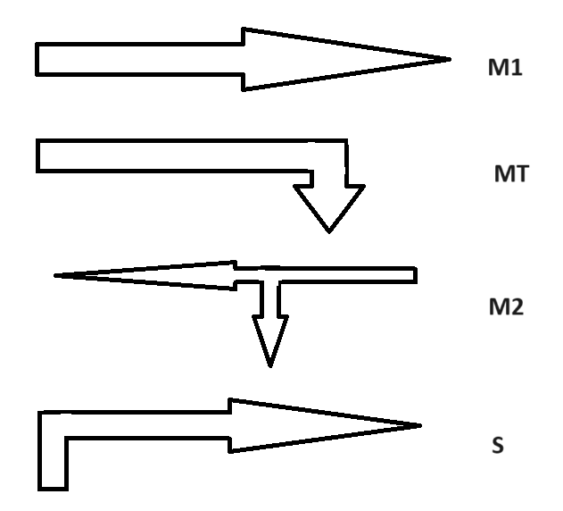
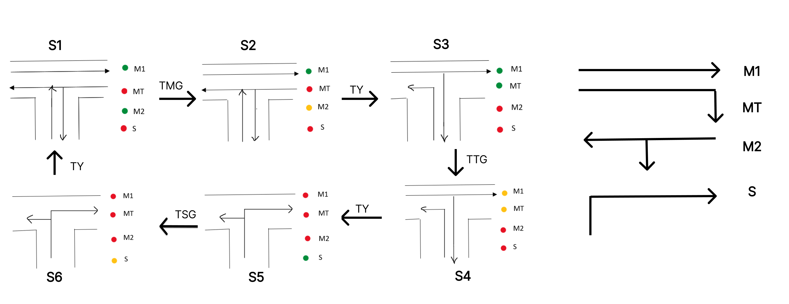
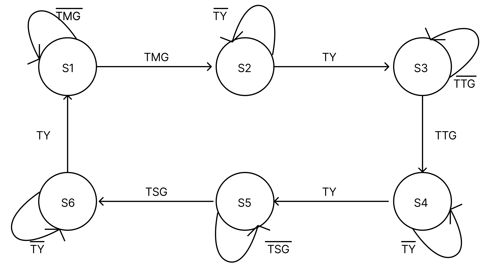
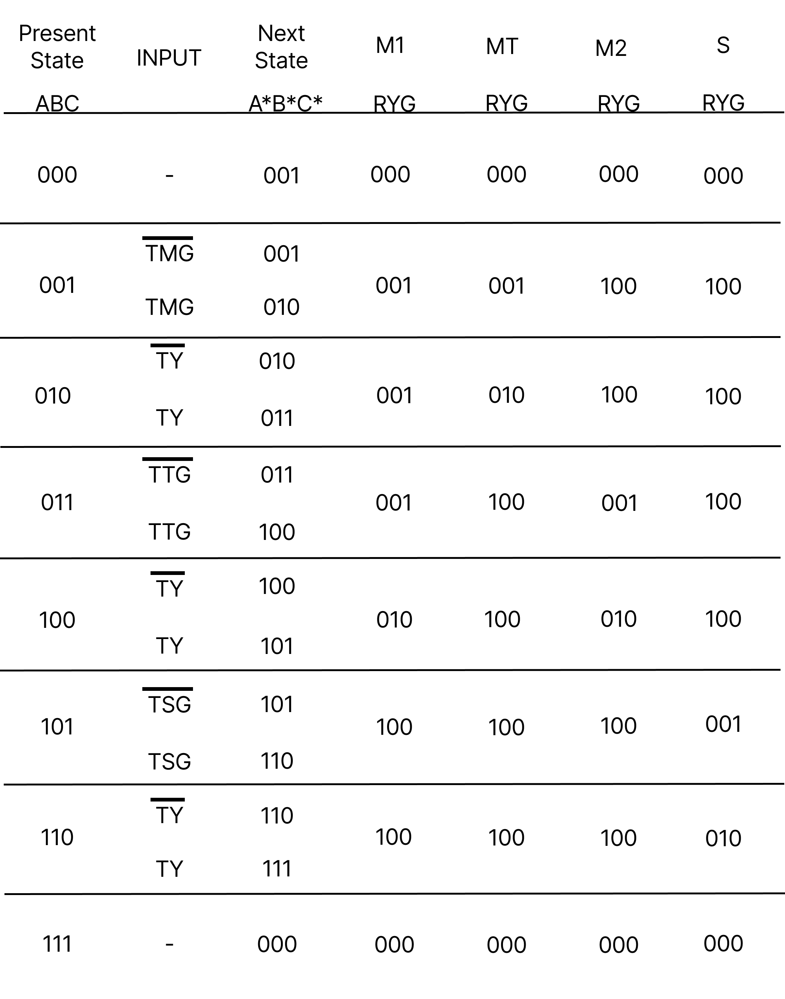
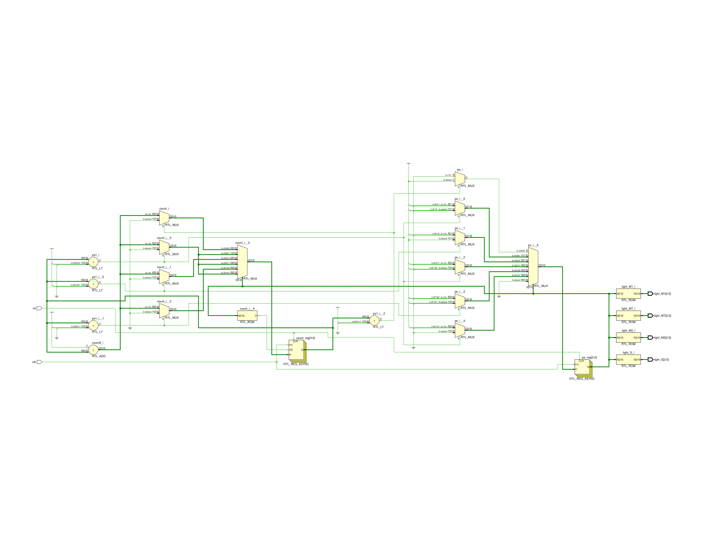
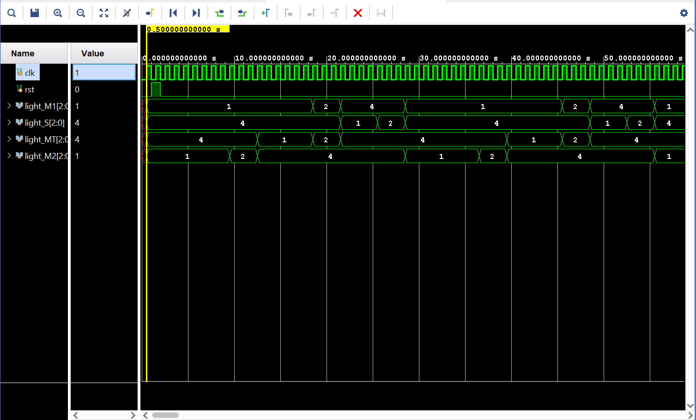

# Traffic Light Controller

This project aims to optimize traffic control at a T-shaped intersection using Verilog, focusing on minimizing vehicle wait times and enhancing traffic flow efficiency.

## Introduction

Efficient traffic management is crucial for urban environments to prevent accidents and reduce congestion. This Verilog-based hardware design approach improves traffic signal timing accuracy, ensuring smoother traffic flow and safer intersections.

### Verilog for Hardware Design

Verilog, a hardware description language (HDL), streamlines the design and simulation of digital circuits. It enables precise modeling and testing of traffic light control systems, enhancing reliability and reducing development time compared to traditional methods.

## Project Overview

This project implements a Verilog-based traffic light control system for a T-shaped road configuration.

### Traffic Light Control System

The system regulates intersection traffic flow with standard red, yellow, and green signals, coordinating pedestrian crossings for enhanced safety and efficiency.

### Traffic Light Functionality

- Red light: Halts traffic in all directions.
- Yellow light: Signals slowing down for cross-town traffic.
- Green light: Permits traffic to proceed safely.


### Challenges Addressed

Common traffic issues, such as congestion due to unregulated traffic levels and unnecessary waiting times, are mitigated through precise traffic level detection and configurable delay times.

## Explanation
### Considered directions


The directions M1, MT, M2, and S considered for our problem analysis are illustrated in the figure.
### States
Furthermore, the problem statement is also explained in the figure. We have taken six states (S1, S2, S3, S4, S5, S6) into consideration, and the state diagram and state table are created based on the logic explained in the figure.



- A green light indicates a clear route with no traffic, allowing an easy flow of vehicles.
- A red light signals a traffic jam, blocking the route for vehicle movement.
- While a yellow light signifies medium traffic flow in the route.

The time delays for transitioning from one state to another are defined as follows:

- TMG: from S1 to S2
- TY: from S2 to S3
- TTG: from S3 to S4
- TY: from S4 to S5
- TSG: from S5 to S6
- TY: from S6 to S1

This sequence continues in a cycle.

### State Diagram

The signal will stay in state S1 for TMG seconds before transitioning to state S2. It will then remain in state S2 for TY seconds before moving to state S3. This pattern continues, with the signal staying in each state for the specified duration. After TY seconds in state S6, the signal returns to state S1, and the cycle repeats.




In the figure, the time delays are as follows:

- TMG: 7 seconds
- TY: 2 seconds
- TTG: 5 seconds
- TSG: 3 seconds

### State Table
In the figure:

- R represents RED
- Y represents YELLOW
- G represents GREEN

States A, B, and C are considered as the current states. The state table is created based on the logic diagram/problem statement shown in the figure.

We can understand the way we wrote the states by taking a look at the example below:-
In state S1(001), M1 = GREEN, implies, RYG value = 001.

Similar logic follows for every state.



## RTL Code
```

      `timescale 1ms / 1ps
      //////////////////////////////////////////////////////////////////////////////////
      // Company: 
      // Engineer: 
      // 
      // Create Date: 29.06.2024 17:33:39
      // Design Name: 
      // Module Name: Traffic_Light_Controller
      // Project Name: 
      // Target Devices: 
      // Tool Versions: 
      // Description: 
      // 
      // Dependencies: 
      // 
      // Revision:
      // Revision 0.01 - File Created
      // Additional Comments:
      // 
      //////////////////////////////////////////////////////////////////////////////////
      
      
      module Traffic_Light_Controller(
      
      
          input clk,rst,
          output reg [2:0]light_M1,
          output reg [2:0]light_S,
          output reg [2:0]light_MT,
          output reg [2:0]light_M2
          );
          
          parameter  S1=0, S2=1, S3 =2, S4=3, S5=4,S6=5;
          reg [3:0]count;
          reg[2:0] ps;
          parameter  sec7=7,sec5=5,sec2=2,sec3=3;
      
         
          
          always@(posedge clk or posedge rst)
              begin
              if(rst==1)
              begin
              ps<=S1;
              count<=0;
              end
              else
              
            
             
                  
                  case(ps)
                      S1: if(count<sec7)
                              begin
                              ps<=S1;
                              count<=count+1;
                              end
                          else
                              begin
                              ps<=S2;
                              count<=0;
                              end
                      S2: if(count<sec2)
                              begin
                              ps<=S2;
                              count<=count+1;
                              end
      
                          else
                              begin
                              ps<=S3;
                              count<=0;
                              end
                      S3: if(count<sec5)
                              begin
                              ps<=S3;
                              count<=count+1;
                              end
      
                          else
                              begin
                              ps<=S4;
                              count<=0;
                              end
                      S4:if(count<sec2)
                              begin
                              ps<=S4;
                              count<=count+1;
                              end
      
                          else
                              begin
                              ps<=S5;
                              count<=0;
                              end
                      S5:if(count<sec3)
                              begin
                              ps<=S5;
                              count<=count+1;
                              end
      
                          else
                              begin
                              ps<=S6;
                              count<=0;
                              end
      
                      S6:if(count<sec2)
                              begin
                              ps<=S6;
                              count<=count+1;
                              end
      
                          else
                              begin
                              ps<=S1;
                              count<=0;
                              end
                      default: ps<=S1;
                      endcase
                  end   
      
                  always@(ps)    
                  begin
                      
                      case(ps)
                           
                          S1:
                          begin
                             light_M1<=3'b001;
                             light_M2<=3'b001;
                             light_MT<=3'b100;
                             light_S<=3'b100;
                          end
                          S2:
                          begin 
                             light_M1<=3'b001;
                             light_M2<=3'b010;
                             light_MT<=3'b100;
                             light_S<=3'b100;
                          end
                          S3:
                          begin
                             light_M1<=3'b001;
                             light_M2<=3'b100;
                             light_MT<=3'b001;
                             light_S<=3'b100;
                          end
                          S4:
                          begin
                             light_M1<=3'b010;
                             light_M2<=3'b100;
                             light_MT<=3'b010;
                             light_S<=3'b100;
                          end
                          S5:
                          begin
                             light_M1<=3'b100;
                             light_M2<=3'b100;
                             light_MT<=3'b100;
                             light_S<=3'b001;
                          end
                          S6:
                          begin 
                             light_M1<=3'b100;
                             light_M2<=3'b100;
                             light_MT<=3'b100;
                             light_S<=3'b010;
                          end
                          default:
                          begin 
                             light_M1<=3'b000;
                             light_M2<=3'b000;
                             light_MT<=3'b000;
                             light_S<=3'b000;
                          end
                          endcase
                  end                
                    
      
      endmodule

```

## Schematic view

[](schematic.pdf)


## Testbench

```
            `timescale 1ms / 1ps
            //////////////////////////////////////////////////////////////////////////////////
            // Company: 
            // Engineer: 
            // 
            // Create Date: 29.06.2024 17:34:02
            // Design Name: 
            // Module Name: Traffic_Light_Controller_TB
            // Project Name: 
            // Target Devices: 
            // Tool Versions: 
            // Description: 
            // 
            // Dependencies: 
            // 
            // Revision:
            // Revision 0.01 - File Created
            // Additional Comments:
            // 
            //////////////////////////////////////////////////////////////////////////////////
            
            
            module Traffic_Light_Controller_TB();
            reg clk,rst;
            wire [2:0]light_M1;
            wire [2:0]light_S;
            wire [2:0]light_MT;
            wire [2:0]light_M2;
            Traffic_Light_Controller dut(.clk(clk) , .rst(rst) , .light_M1(light_M1) , .light_S(light_S)  ,.light_M2(light_M2),.light_MT(light_MT)   );
            initial
            begin
                clk=1'b0;
                forever #(1000/2) clk=~clk;
            end
            //    initial
            //    $stop;//to add ps
            initial
            begin
                rst=0;
                #1000;
                rst=1;
                #1000;
                rst=0;
                #300000;
            end
            
            endmodule
```
## Waveform



## Result
In this model, we observed various stages that describe each signal's behavior. For example, consider the first stage where the north-south signals give an indication. When the north-south signal is red, the east-west signal turns green, allowing traffic to move in the respective direction. After a delay, the east-west signal turns yellow, followed by red. Simultaneously, the north-south signal transitions from red to green, allowing traffic to flow. This process repeats in a continuous loop.

Modern multi-way traffic management significantly improves traffic conditions by sensing traffic intensity and adjusting time allocations accordingly. In this model, Verilog HDL is used for circuit description, and the code is simulated using Xilinx 14.5.

This traffic light control system operates on a fixed time allocation concept for each side of the junction, which does not change with varying traffic density. Timings at each junction are fixed. Sometimes, higher traffic density on one side of the junction requires a longer green signal duration than the standard allotted time.

Thus, the traffic light control system facilitates an orderly flow of vehicles, reducing obstacles and high-level accidents that occur daily. However, many areas or small towns still lack traffic light control facilities, leading to frequent accidents. Therefore, it is essential to implement such facilities to control and maintain traffic effectively.
